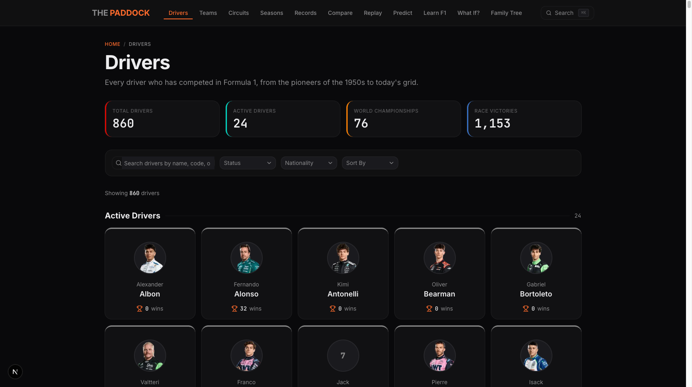

# The Paddock

**A free, open-source Formula 1 encyclopedia spanning 75+ years of racing history.**

Browse 860+ drivers, 100+ constructors, 80+ circuits, and every season from 1950 to today. Replay races lap by lap, simulate alternate championship outcomes, compare telemetry data, and explore F1 through interactive visualizations and educational content.

**[Live Site](https://the-paddock-f1.vercel.app)**



## Why This Exists

Most F1 reference sites are either paywalled, buried in ads, or treat the data as static tables. The Paddock was built to be the resource I wanted as a fan: fast, interactive, and free. Something where you can look up a driver's career stats, then immediately jump into replaying their greatest race, compare their telemetry against a rival, or run a "what if" simulation with different scoring rules.

The goal is to make F1's massive history accessible and explorable, not just readable.

## Features

### Data & Reference
- **860+ driver profiles** with career stats, championship results, and headshots
- **100+ constructor profiles** with historical team lineage and ownership changes
- **80+ circuits** with track maps and geographic coordinates
- **Every season from 1950 to 2026** with full standings, race results, qualifying, and pit stops

### Interactive Tools
- **Race Replay** - Animated lap-by-lap visualization with driver positions on track, safety car markers, and scrub controls
- **What-If Simulator** - Recalculate any championship using alternate scoring systems (1950s-era, modern, custom). Remove DNFs, adjust rules, share results via URL
- **Telemetry Compare** - Overlay fastest-lap traces from multiple drivers. Speed, throttle, brake, and gear data side by side
- **AI Race Predictor** - Browser-based ML model (ONNX runtime, no server needed) trained on historical data to forecast race outcomes
- **Constructor Family Tree** - Visual lineage of how teams evolved through mergers, buyouts, and rebrands

### Content & Learning
- **25+ educational articles** covering rules, technical regulations, pit strategy, aero fundamentals, famous rivalries, and historic controversies (Crashgate, Spygate, Senna vs Prost)
- **Shareable Graphics Generator** - Create F1-themed social media cards with customizable data overlays

### Search & Navigation
- **Command palette** (Cmd+K) with fuzzy search across drivers, teams, and circuits
- **Filterable listings** by nationality, status, and sortable by stats
- Responsive, mobile-first dark UI

## Tech Stack

| Layer | Technology |
|-------|-----------|
| Framework | Next.js 16, React 19, TypeScript |
| Styling | Tailwind CSS 4, shadcn/ui components |
| Data Viz | Recharts, react-simple-maps |
| Animations | Motion (Framer Motion) |
| Search | cmdk + Fuse.js (client-side fuzzy search) |
| ML Inference | ONNX Runtime Web (browser-based predictions) |
| Content | MDX via next-mdx-remote |
| Deployment | Vercel |

## Getting Started

### Prerequisites

- Node.js 18+
- npm, yarn, pnpm, or bun

### Run Locally

```bash
git clone https://github.com/sacredvoid/the-paddock.git
cd the-paddock
npm install
npm run dev
```

Open [http://localhost:3000](http://localhost:3000) to view the app.

### Available Scripts

```bash
npm run dev      # Start development server
npm run build    # Production build
npm run start    # Serve production build
npm run lint     # Run ESLint
```

## Project Structure

```
the-paddock/
├── app/                    # Next.js App Router
│   ├── (main)/             # Main routes (drivers, teams, circuits, seasons, etc.)
│   └── api/                # API routes (OG images, telemetry, season data)
├── components/             # 70+ React components
│   ├── ui/                 # Base UI primitives (cards, dialogs, tabs, etc.)
│   ├── search/             # Command palette and search
│   ├── charts/             # Recharts wrappers
│   └── ...                 # Feature-specific components
├── data/                   # Static JSON datasets
│   ├── drivers.json        # 860+ drivers
│   ├── teams.json          # All constructors
│   ├── circuits.json       # Track data with coordinates
│   ├── seasons/            # Per-year race data (1950-2026)
│   └── telemetry/          # Lap-by-lap telemetry for recent races
├── content/learn/          # MDX educational articles
├── lib/                    # Utilities, types, data access, engines
├── public/                 # Static assets (circuit SVGs, ML models)
└── docs/plans/             # Internal planning docs
```

## Data Sources

Race results, driver statistics, and historical records are compiled from publicly available Formula 1 data. Telemetry data covers selected recent races. The dataset is updated as new seasons progress.

## License

MIT
